# Muzer 🎧

A collaborative, real-time music queue. A **host** opens a room, shares two
codes, friends join and queue YouTube tracks, everyone **votes**, and the
top-ranked track plays next.

Guests can also **pay to boost** a track past the voting: a bid (UPI / card via
Razorpay) outranks every cheaper track, 95% is routed straight to the host's
linked account and 5% stays with the platform.

---

## Big picture

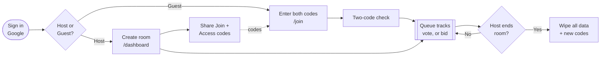

---

## Tech stack

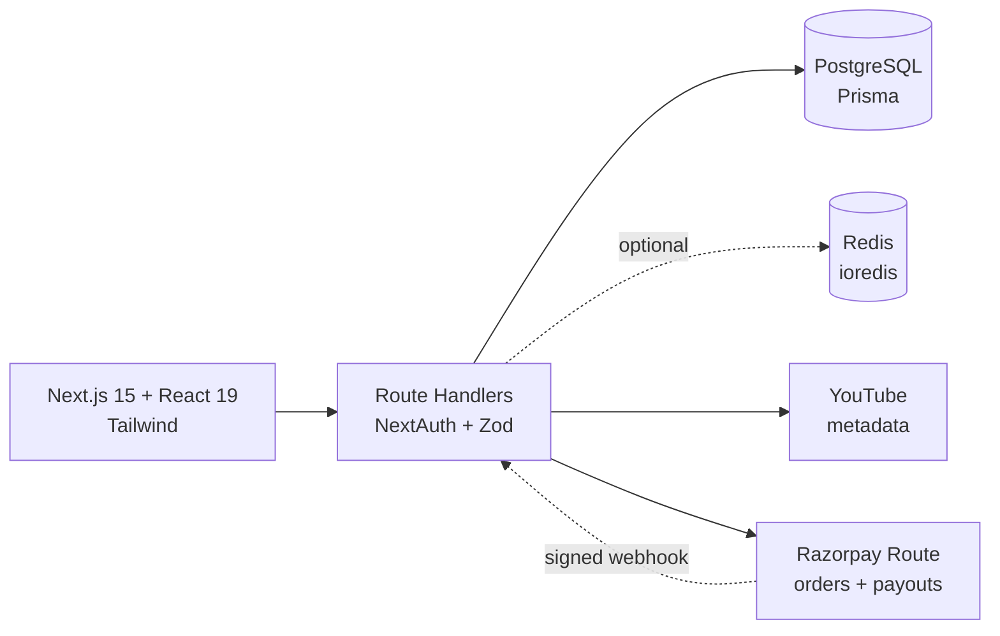

| Concern | Choice |
|---|---|
| Framework | Next.js 15 (App Router), React 19, TypeScript |
| Auth | NextAuth v4 (Google) |
| DB | PostgreSQL + Prisma |
| Realtime | SSE + Redis pub/sub *(in-process fallback)* |
| Cache / limits | Redis via ioredis *(optional)* |
| Payments | Razorpay Route (INR, UPI / cards) |
| Validation | Zod |

---

## Data model

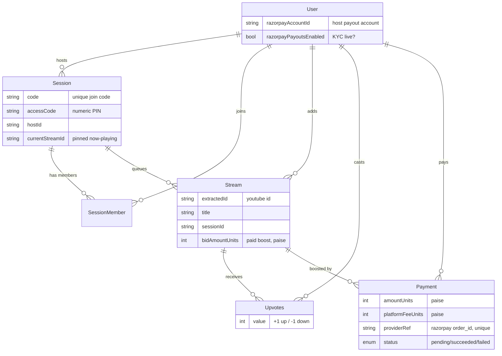

> One vote per `(user, stream)` is enforced by a composite unique on `Upvotes`;
> net score = sum of `value`. `Payment.streamId` is nullable with
> `ON DELETE SET NULL` — a boosted track is eventually played and deleted, but
> the financial record must survive it.

### Queue ordering

Every consumer — the queue API, the deck-advance endpoint, and the client's
optimistic re-sort — ranks through one shared comparator (`compareQueue` in
[`app/lib/queue.ts`](./app/lib/queue.ts)):

```text
bidAmountUnits DESC  →  net votes DESC  →  createdAt ASC
```

Any paid track outranks every unpaid one. The tie-break is explicit and never
relies on sort stability, so the server and the UI can't disagree about what
plays next.

---

## Workflows

### 🔑 Join — two-code auth

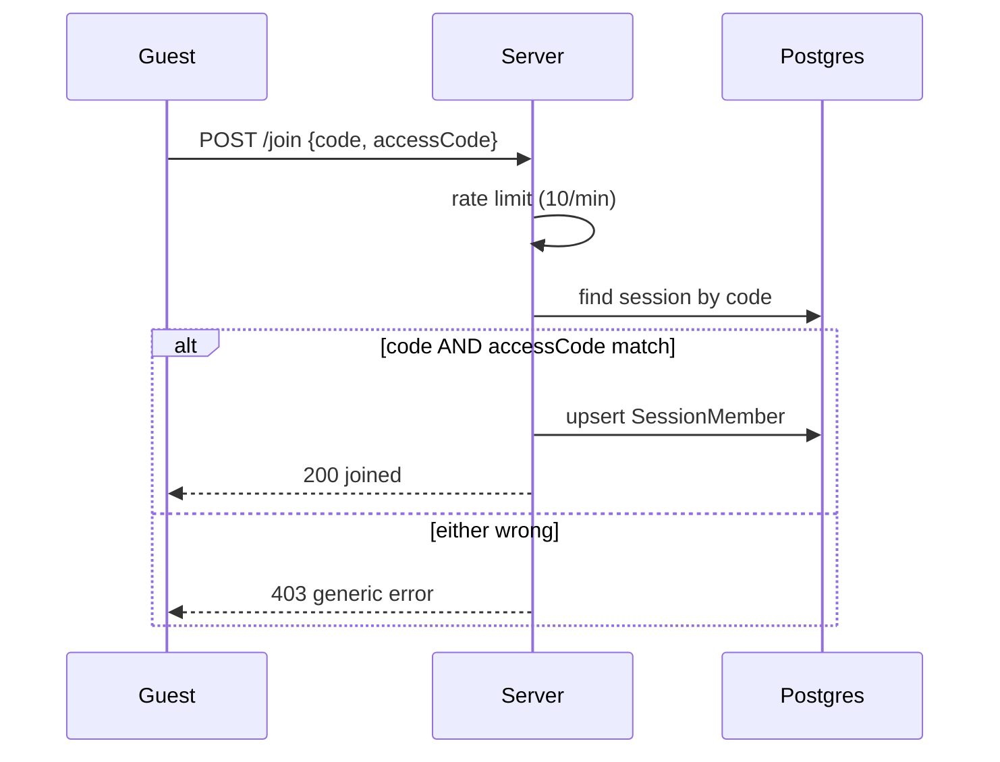

### ➕ Add a track

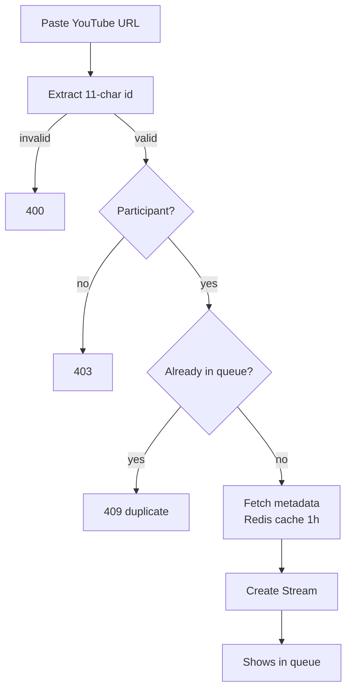

### 👍👎 Vote — one per song, toggleable

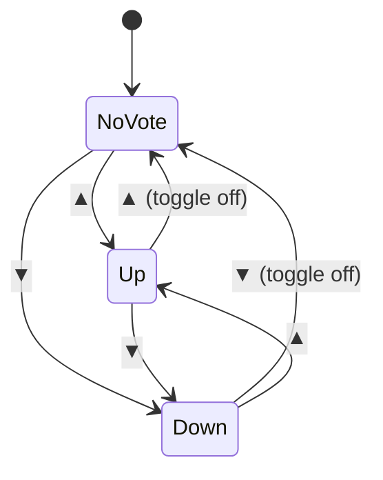

### 💸 Bid — pay to boost a track

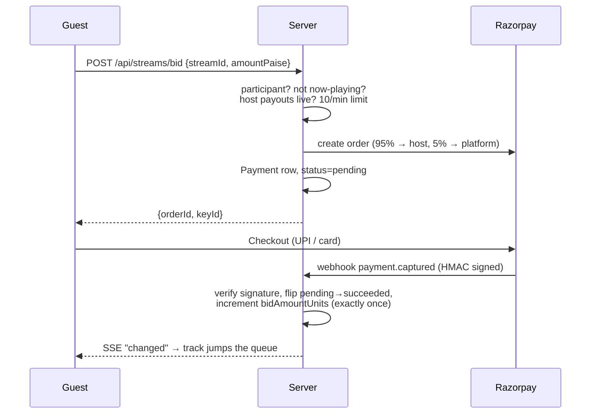

> The queue never moves on the client. `bidAmountUnits` changes in exactly one
> place — the verified webhook — so a guest who closes Checkout, retries, or
> replays a request can't buy position twice.

### 🎛️ Now playing / next

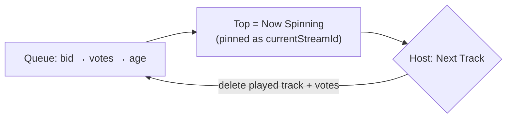

> The playing track is **pinned** on the session row, so incoming votes and bids
> reorder only the *upcoming* queue — they never swap the song mid-play. Only
> the host's Next Track (or the player's `ended` event) advances the deck.

### ⏹️ End session — wipe everything

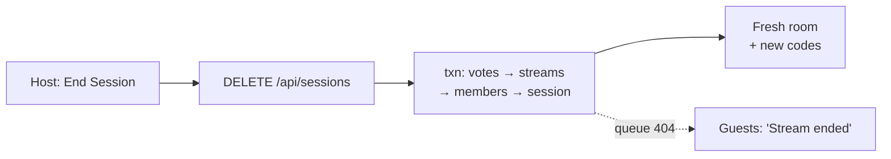

---

## API

| Method & path | Who | Purpose |
|---|---|---|
| `GET /api/sessions` | host | Current room + codes |
| `POST /api/sessions` | host | Create room *(idempotent)* |
| `DELETE /api/sessions` | host | End room + delete its data |
| `POST /api/sessions/join` | user | Join `{ code, accessCode }` |
| `GET /api/streams?code=` | member | Queue (`upvotes`, `myVote`) |
| `GET /api/streams/events?code=` | member | SSE stream of queue-changed events |
| `GET /api/streams/search?code=&q=` | member | YouTube search results |
| `POST /api/streams` | member | Add `{ url, sessionCode }` |
| `DELETE /api/streams` | host | Remove `{ streamId }` |
| `POST /api/streams/upvote` | member | Up / toggle `{ streamId }` |
| `POST /api/streams/downvote` | member | Down / toggle `{ streamId }` |
| `POST /api/streams/next` | host | Advance the deck |
| `POST /api/streams/bid` | member | Start a bid → Razorpay order |
| `POST /api/host/payment/razorpay` | host | Create / fetch Route linked account |
| `GET /api/host/payment/status` | host | `{ linked, payoutsEnabled }` |
| `POST /api/webhooks/razorpay` | Razorpay | Signed payment + account events |

Status codes: `401` no auth · `403` not a member / wrong codes · `404` gone ·
`409` duplicate, or bid rejected (now playing / host not set up) · `429`
rate-limited.

> `/api/webhooks/razorpay` is the one unauthenticated endpoint — it has no
> session and is proven authentic by an HMAC-SHA256 signature over the raw body.

---

## Setup

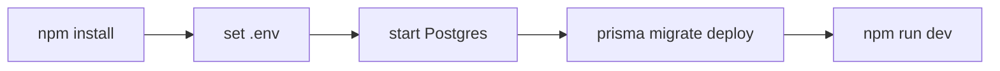

```bash
npm install
npx prisma migrate deploy
npm run dev          # http://localhost:3000
```

### Environment variables

| Variable | Required | Purpose |
|---|---|---|
| `DATABASE_URL` | ✅ | Postgres connection string |
| `NEXTAUTH_SECRET` | ✅ | Signs the session JWT |
| `NEXTAUTH_URL` | ✅ (prod) | Base URL |
| `GOOGLE_CLIENT_ID` / `GOOGLE_CLIENT_SECRET` | ✅ | Google OAuth |
| `REDIS_URL` | ⬜ | Cross-instance realtime, rate limits, metadata cache |
| `YOUTUBE_API_KEY` | ⬜ | Official Data API instead of scraping *(recommended in prod)* |
| `RAZORPAY_KEY_ID` / `RAZORPAY_KEY_SECRET` | 💸 | Route API — creates orders & linked accounts |
| `RAZORPAY_WEBHOOK_SECRET` | 💸 | Verifies webhook HMAC signatures |
| `PLATFORM_FEE_PERCENT` | ⬜ | Platform cut per bid *(default `5`)* |
| `BID_MIN_PAISE` / `BID_MAX_PAISE` | ⬜ | Bid bounds in paise *(default ₹1 – ₹10,000)* |

✅ required · 💸 required only for bidding · ⬜ optional

Without the Razorpay keys everything else still runs — the build succeeds, the
Bid button reports that the host hasn't set up payments, and no other route is
affected. The client is built lazily, so a missing key fails one request loudly
rather than breaking the whole app.

> ⚠️ `.env` (secrets) is gitignored — only `.env.example` is tracked.
> DB options (Neon / Docker / etc.) are in [`DATABASE.md`](./DATABASE.md).

---

## Security at a glance

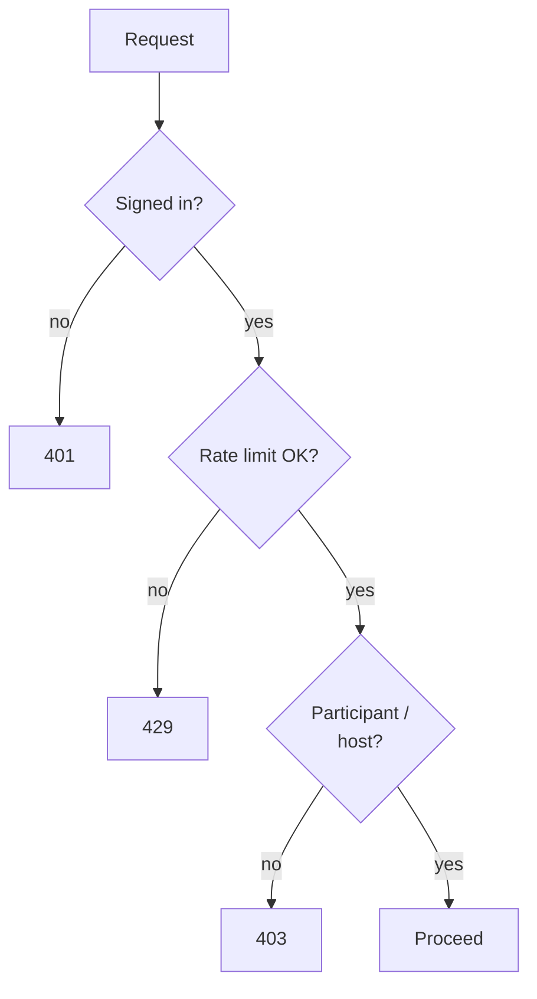

- Two-code join · CSPRNG codes (`crypto.randomInt`) · per-user rate limits
  (Redis + in-proc fallback) · host-only deck/end controls.

**Money-specific:**

- **Server-authoritative amounts** — the charge and the 95/5 split are computed
  server-side and bounded by `BID_MIN/MAX_PAISE`; a client-supplied amount is
  validated, never trusted.
- **Signed webhooks** — HMAC-SHA256 over the raw body, compared in constant time
  (`crypto.timingSafeEqual`). An unsigned or mismatched request gets `400` and
  changes nothing.
- **Exactly-once crediting** — the webhook credits a bid inside a transaction
  that flips `pending → succeeded` conditionally. Razorpay retries until it sees
  a 2xx, and duplicate deliveries — sequential *or* concurrent — increment
  `bidAmountUnits` exactly once.

---

## Scripts

| Command | Does |
|---|---|
| `npm run dev` | Dev server (Turbopack) |
| `npm run build` | Production build |
| `npm start` | Run production build |
| `npm run lint` | ESLint |
| `npm run prisma:migrate` | `prisma migrate dev` |
| `npm run prisma:generate` | Regenerate Prisma client |
