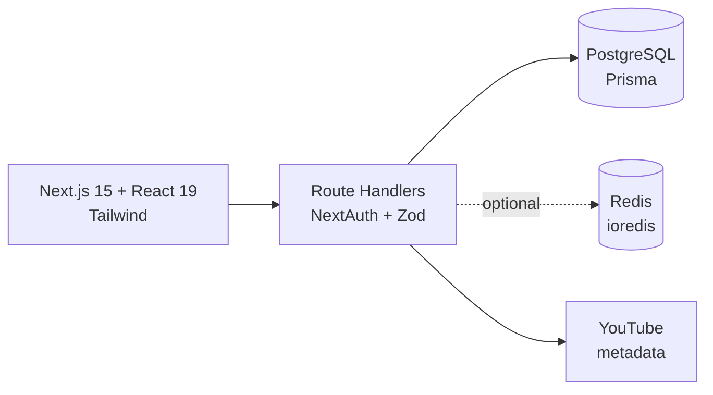
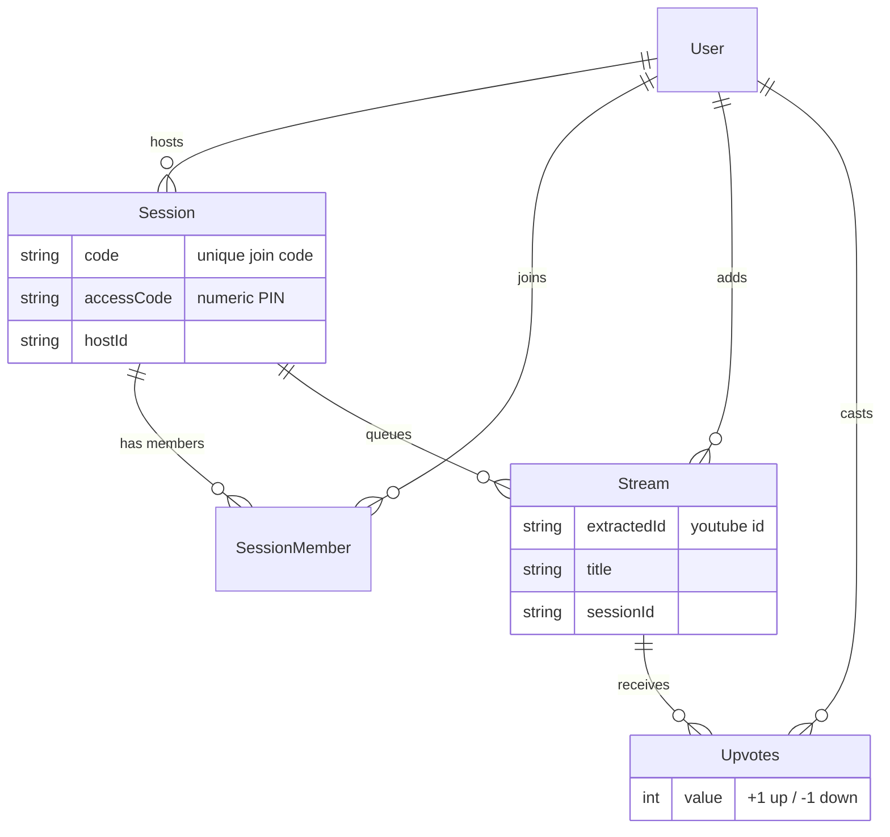
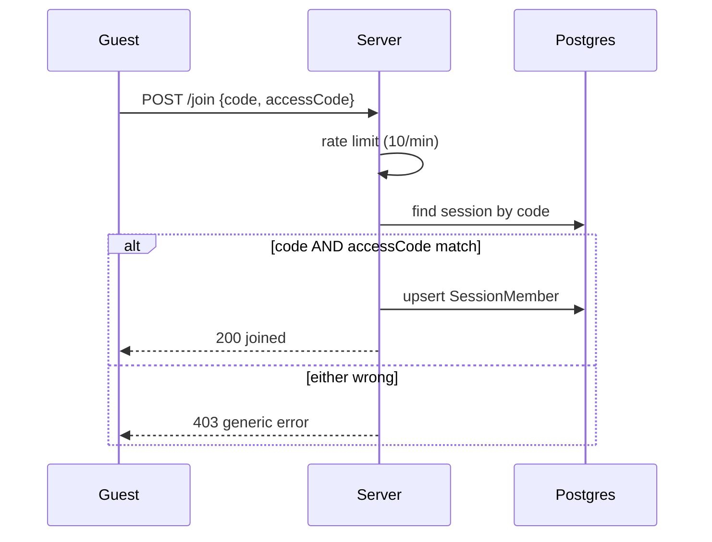
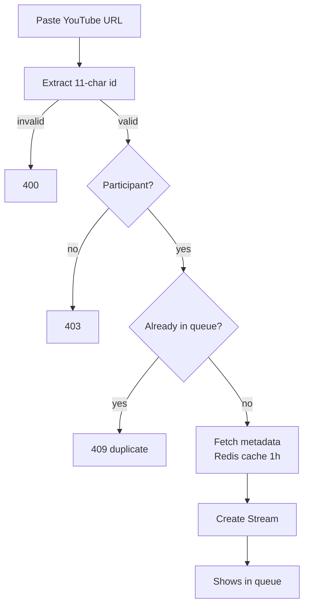
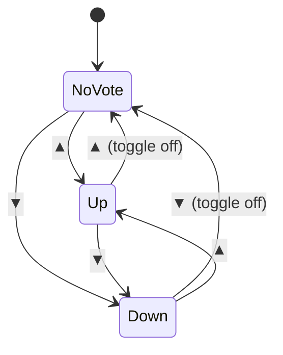
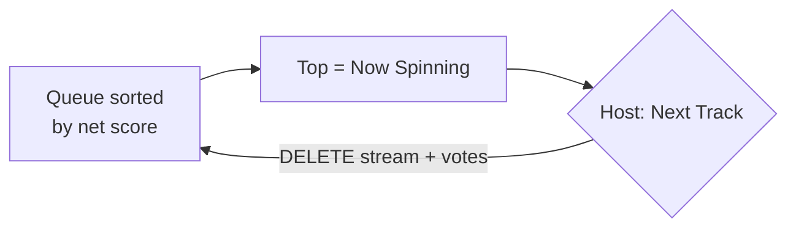
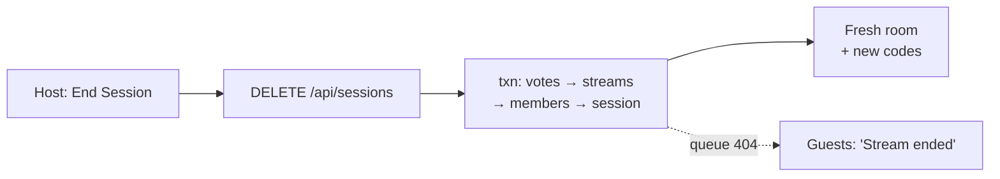
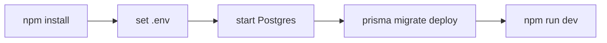
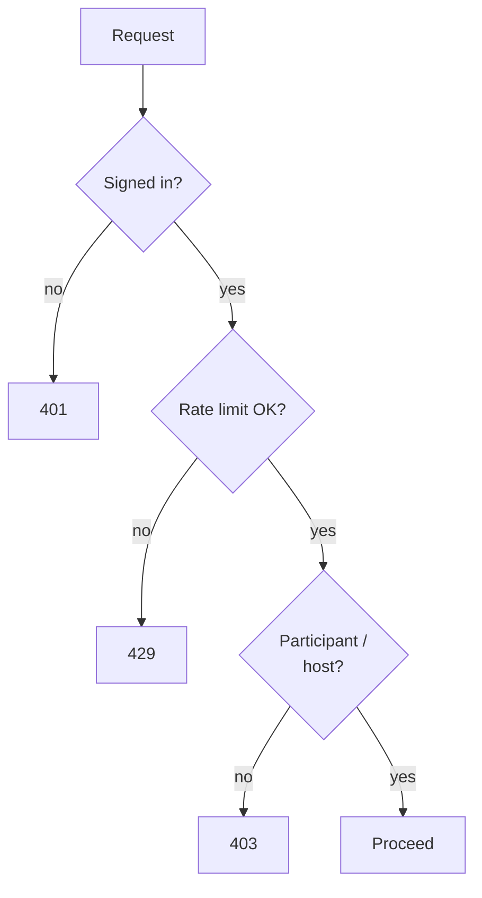

# Muzer 🎧

A collaborative, real-time music queue. A **host** opens a room, shares two
codes, friends join and queue YouTube tracks, everyone **votes**, and the
highest-voted track plays next.

---

## Big picture


---

## Tech stack



| Concern | Choice |
|---|---|
| Framework | Next.js 15 (App Router), React 19, TypeScript |
| Auth | NextAuth v4 (Google) |
| DB | PostgreSQL + Prisma |
| Cache / limits | Redis via ioredis *(optional)* |
| Validation | Zod |

---

## Data model



> One vote per `(user, stream)` is enforced by a composite unique on `Upvotes`;
> net score = sum of `value`.

---

## Workflows

### 🔑 Join — two-code auth



### ➕ Add a track



### 👍👎 Vote — one per song, toggleable



### 🎛️ Now playing / next



### ⏹️ End session — wipe everything



---

## API

| Method & path | Who | Purpose |
|---|---|---|
| `GET /api/sessions` | host | Current room + codes |
| `POST /api/sessions` | host | Create room *(idempotent)* |
| `DELETE /api/sessions` | host | End room + delete its data |
| `POST /api/sessions/join` | user | Join `{ code, accessCode }` |
| `GET /api/streams?code=` | member | Queue (`upvotes`, `myVote`) |
| `GET /api/streams/events?code=` | member | SSE stream of queue-changed events |
| `GET /api/streams/search?code=&q=` | member | YouTube search results |
| `POST /api/streams` | member | Add `{ url, sessionCode }` |
| `DELETE /api/streams` | host | Remove `{ streamId }` |
| `POST /api/streams/upvote` | member | Up / toggle `{ streamId }` |
| `POST /api/streams/downvote` | member | Down / toggle `{ streamId }` |

Status codes: `401` no auth · `403` not a member / wrong codes · `404` gone ·
`409` duplicate · `429` rate-limited.

---

## Setup



```bash
npm install
npx prisma migrate deploy
npm run dev          # http://localhost:3000
```

### Environment variables

| Variable | Required | Purpose |
|---|---|---|
| `DATABASE_URL` | ✅ | Postgres connection string |
| `NEXTAUTH_SECRET` | ✅ | Signs the session JWT |
| `NEXTAUTH_URL` | ✅ (prod) | Base URL |
| `GOOGLE_CLIENT_ID` / `GOOGLE_CLIENT_SECRET` | ✅ | Google OAuth |
| `REDIS_URL` | ⬜ | Enables rate limiting + metadata cache |

> ⚠️ `.env` (secrets) is gitignored — only `.env.example` is tracked.
> DB options (Neon / Docker / etc.) are in [`DATABASE.md`](./DATABASE.md).

---

## Security at a glance



- Two-code join · CSPRNG codes (`crypto.randomInt`) · per-user rate limits
  (Redis + in-proc fallback) · host-only deck/end controls.

---

## Scripts

| Command | Does |
|---|---|
| `npm run dev` | Dev server (Turbopack) |
| `npm run build` | Production build |
| `npm start` | Run production build |
| `npm run lint` | ESLint |
| `npm run prisma:migrate` | `prisma migrate dev` |
| `npm run prisma:generate` | Regenerate Prisma client |
